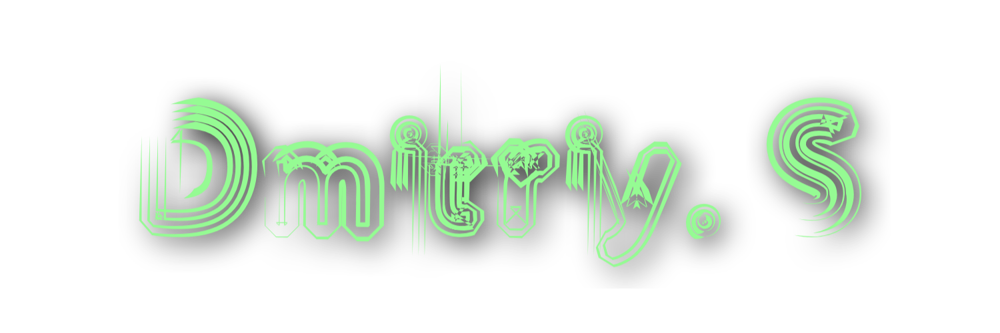
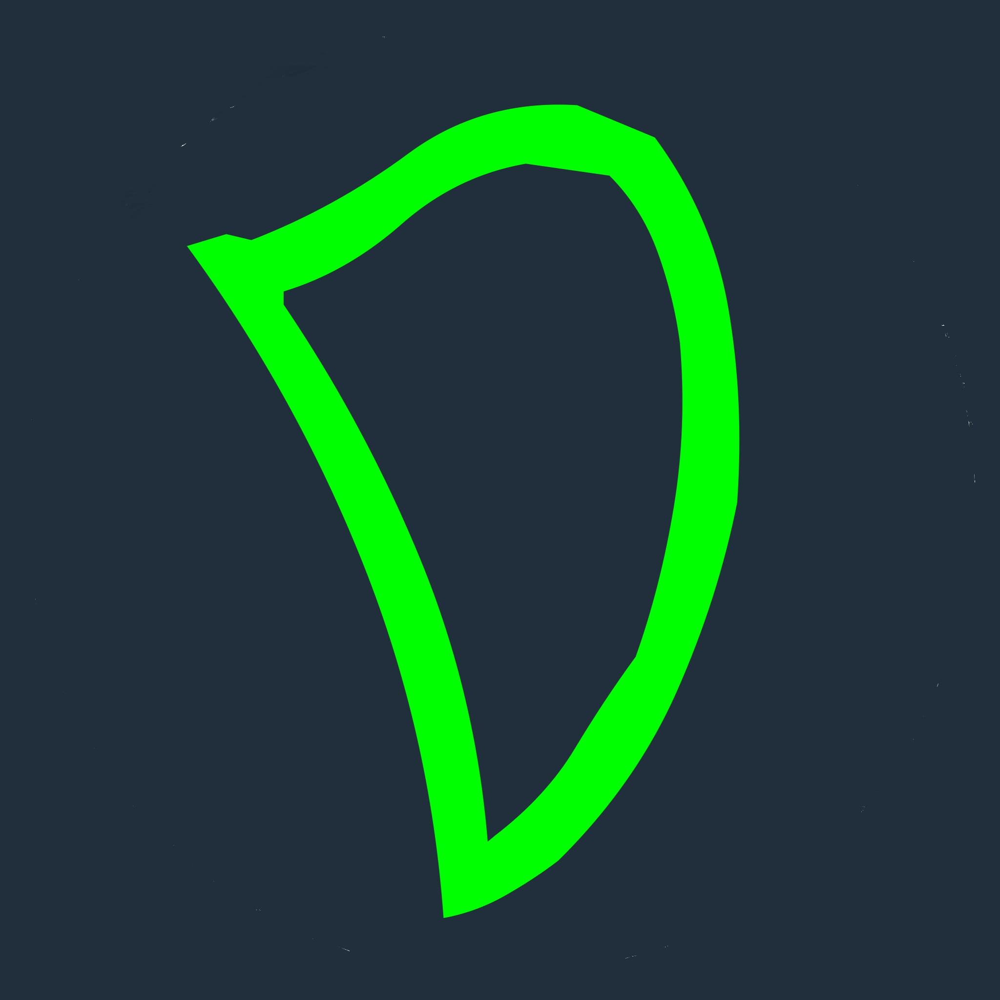

<head>
    <meta name="viewport" content="width=device">
    <meta charset="encoding="UTF-8" />
    <link rel="stylesheet" href="style.css" type="text/css">
</head>
<body class="main">
    
  <h3> Links: </h3>
<a style="font-color:white;" class="mtext" href="https://www.dhotspot.dev"> DHotspot (Personal website) </img> |</a>
<a style="font-color:white;" class="mtext" href="https://dhotspotblog.wordpress.com"> Wordpress  |</a>
<a style="font-color:white;" class="mtext" href="https://mastodon.online/@DHotspot"> Mastodon 🐘 |</a>
<a style="font-color:white;" class="mtext" href="https://www.vers.social/@dmitriys"> Vers </img> |</a>
<a style="font-color:white;" class="mtext" href="mailto:contact@dhotspot.dev"> Email me! 📧 |<a>
  

 
</ul>
</body>
