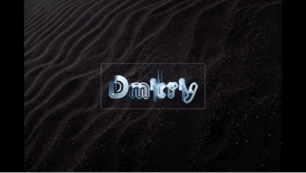

<head>
    <meta name="viewport" content="width=device">
    <meta charset="encoding="UTF-8" />
    <link rel="stylesheet" href="style.css" type="text/css">
</head>
<body>

</img>

<h2> Welcome to my Github! </h2>

<h3> About me: </h3>
<ul>
  <li>Computer Science Student exploring technology and engineering</li>
  

  <h3> Links: </h3>

  

 
</ul>
</body>
